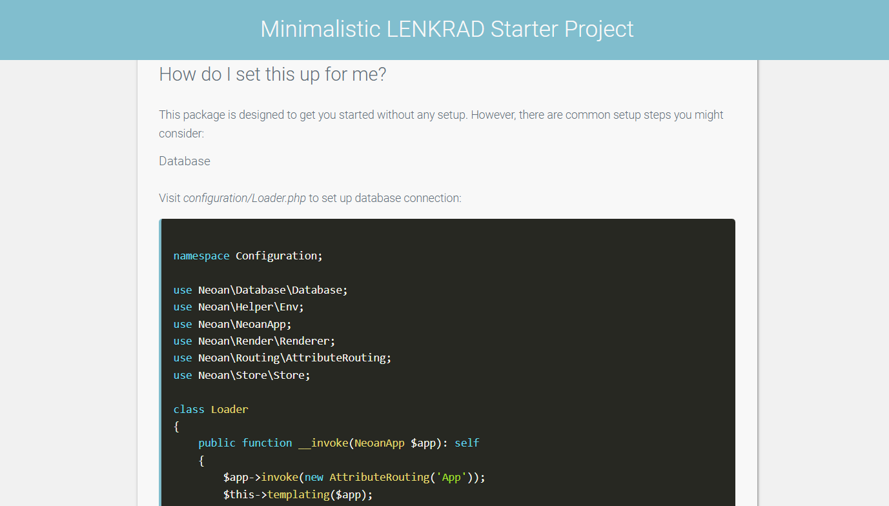

# Clean & simple starter project for modern web-projects (LENKRAD PHP)

## Requirements
- PHP 8.1+
- SQLite, MariaDB, or MySQL

## Installation
`composer create-project neoan.io/web-starter-project my-app`

`cd my-app`

`php dev`

> This repository is set up as a template, so easy cloning is possible as well [use as template](https://github.com/sroehrl/lenkrad-web-starter/generate)

## Documentation

This project explains itself on the demo-page it provides when running it.

Please refer to the [LENKRAD-docs](https://lenkrad.neoan3.rocks) for a full documentation.
